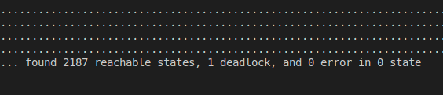

# bip2models
1. BIP2材料
	1. 中文文档： https://nado-dev.github.io/BIP2-Doc-ZH/
	2. 原始文档：https://www-verimag.imag.fr/TOOLS/DCS/bip/doc/latest/html/Bip2-simplified.html
2. BIP2编译器
	1. 教程要求安装```apt-get install openjdk-6-jre```，但是由于系统的更新，openjdk6已经无法直接安装了，我在ubuntu20.04的基础上，安装的 openjdk-8-jre，后续运行是正常的
	2. 运行编译器需要设置环境变量，在终端执行``` source setup.sh```
3. BIP2 to CPP
	1. 执行bipc可将bip文件转成cpp文件
			```
			bipc.sh -I . -p ADS_DP -d "ADS_DP_Full()"\ --gencpp-enable-marshalling  --gencpp-output output
			```
		1. ADS_DP是包名
		2. ADS_DP_Full是包中定义的复合组件名，相当于main函数
		3. --gencpp-enable-marshalling 可以支持在执行编译好的cpp文件时输出状态数
		4. --gencpp-output output 设置输出的cpp文件的目标文件夹
4. CPP编译
	1. 第三步的过程中会输出完整的C++工程，包括全部的工程结构，CMakeList等
	2. 由于BIP2编译器所链接的库比较古老，因此在链接库的时候会出问题，这时候需要在第三步生成好的CMakeList中配置一下Flag
		```
		add_definitions(-D_GLIBCXX_USE_CXX11_ABI=0)  # 
		set(CMAKE_EXE_LINKER_FLAGS "${CMAKE_EXE_LINKER_FLAGS} -no-pie")
		set(CMAKE_SHARED_LINKER_FLAGS "${CMAKE_SHARED_LINKER_FLAGS} -no-pie")
		```
	3. 解释
		- **add_definitions(-D_GLIBCXX_USE_CXX11_ABI=0)**: 强制使用旧版libstdc++ ABI（GCC5之前的二进制兼容方式）。作用是避免与使用旧ABI编译的三方库发生符号不匹配（如std::string、std::list的符号名）。代价是与新ABI的库不兼容。

		- **set(CMAKE_EXE_LINKER_FLAGS "... -no-pie")**: 给可执行文件链接器加上-no-pie，禁用 PIE（Position Independent Executable，位置无关可执行）。常用于需要固定装载地址、旧工具链兼容、或与某些静态/低层注入工具协作的场景。现代发行版默认启用PIE，关闭后可能降低ASLR带来的安全性。

		- **set(CMAKE_SHARED_LINKER_FLAGS "... -no-pie")**: 给共享库链接器也加 -no-pie。通常共享库本身使用 -fPIC 而不是 -no-pie，但这里统一关闭PIE以避免与某些工具链/加载流程的兼容性问题。若不需要，建议仅在可执行目标上使用 -no-pie。
5. 运行
	1. 在执行 cmake和make之后会生成可执行文件，为了知道所编写的模型中状态数量，运行的时候
		```
		./${可执行文件} --explore
		```
		然后就会输出，状态数量
	2. 如何获得更多的状态数量？
		1. 一个复合组件中如果有N个component，每个component有M个状态，那么运行得到的状态数量就是$N^M$个，运行结果如下所示
			